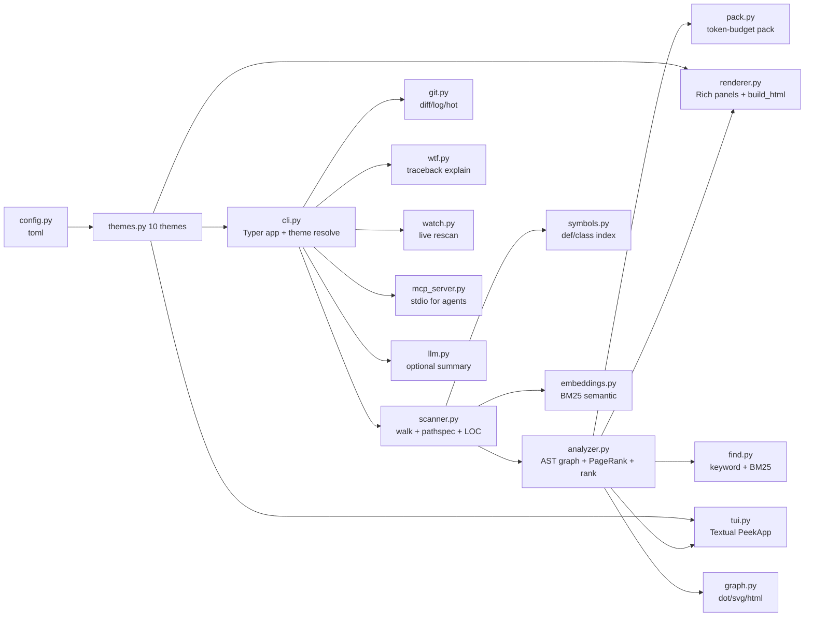

# CLAUDE.md

This file provides guidance to Claude Code (claude.ai/code) when working with code in this repository.

# peek — htop for codebases

Zero-config codebase cartographer. Python-native (`ast`, no tree-sitter), Rich static + Textual TUI, works offline, never crashes on weird files. Entry: `peek [PATH]` (TUI) / `peek --no-tui` (static).

## Repo layout (two levels — don't confuse)

```
D:/peek/peek/          ← git root, CLAUDE.md / README.md / docs.md / mkdocs.yml live here
  peek/                ← PyPI project root (pyproject.toml, name=peek-code)
    peek/              ← Python package (scanner.py, analyzer.py, cli.py, …)
    tests/             ← pytest suites (testpaths=["tests"], pythonpath=["."])
    assets/            ← demo.gif/.svg/.html + themes/*.svg
  docs/                ← research pack + superpowers specs/plans
```

`pyproject.toml` lives at `peek/pyproject.toml`, NOT at git root. Install from git root: `pip install -e "./peek[dev]"`. From `peek/`: `pip install -e ".[dev]"`.

## Commands

```bash
cd peek                              # PyPI root — run install/tests/build from here
pip install -e ".[dev]"              # dev install (from git root: pip install -e "./peek[dev]")
pytest -q                            # full suite (~150 tests, ~1 skipped)
pytest tests/test_analyzer.py -v     # single file
pytest tests/test_comprehensive_tdd.py -v
pytest -k <name> -v                  # single test by keyword
pytest tests/test_demo_assets.py -v  # GIF/HTML asset guards
ruff check peek                      # lint (line-length 100; select E,F,I,B,SIM; ignore E501)
ruff format --check peek             # format check
peek --no-tui                        # static Rich on cwd (screenshot-ready, pipeable)
peek .                               # TUI (q quit, / filter, t theme, w watch, ? help)
peek scan . --json | jq .stats       # scan only
peek analyze . --html -o report.html # graph + ranking + HTML
python -m peek.tools.gen_demo        # regen assets/demo.gif + demo.svg (Pillow, no vhs/ffmpeg)
```

Requires Python 3.11+. Runtime deps: `typer`, `click`, `rich`, `textual`, `pathspec`. Optional: `openai`/`anthropic` (`[llm]`), `mcp>=1.0` (`[mcp]`), `Pillow` + `pytest` + `ruff` (`[dev]`).

Build/release: `cd peek && python -m build && twine check dist/*` (CI does this; release on `git tag v*` publishes to PyPI).

## Architecture mindmap

Pipeline: `scan → analyze → render (static / HTML / TUI)`; `pack / find / graph / mcp / wtf / watch` are consumers of scan+analyze.



## Module map (`peek/peek/`)

| File | Owns — read this when… |
|------|------------------------|
| `cli.py` | All Typer commands/flags, spinner, `_write_output_safely`, `--theme-list`; start here for CLI changes |
| `scanner.py` | `scan(root, max_files=2000)`: manual stack walk, `DEFAULT_IGNORE_DIRS` + `pathspec` gitwildmatch, null-byte binary check, LOC/language, `detect_tech_stack`, `detect_entry_points` |
| `analyzer.py` | `_module_name_for` (`src/` strip), `_resolve_local_import`, `build_graph` (stdlib filtered via `sys.stdlib_module_names`), 5-iter PageRank (damping 0.85), `rank_files` (pr_norm*5 + in-degree + entry 5.0 + main-guard 0.5 − depth penalties), `summarize` |
| `renderer.py` / `_ascii_graph.py` | Static Rich panels + `build_html`; one-liner ASCII graph |
| `tui.py` | `PeekApp`: theme-templated CSS (`linear` easing only — `ease-out` breaks Textual CSS parse), `asyncio` imported at top (filter needs it), keys `q j/k enter o / ? t w c esc` |
| `themes.py` / `config.py` | 10 themes × 15 `#RRGGBB` tokens validated at import; `resolve_theme`: `cli --theme` > `PEEK_THEME` env > `config.toml` > `anthropic-pro`; bad name → exit 2. Config: `PEEK_CONFIG` > XDG > `~/.config/peek` > `~/.peek`, tolerant of missing/malformed TOML |
| `pack.py` / `find.py` / `embeddings.py` | `--pack` (budget default 8000, `len//4` est or tiktoken `cl100k_base`, `--ask` filter, `--format md/xml/txt`, `--diff/--staged/--clip/--dry-run`, URL fetch); `find` scoring = filename(10) + content(5+occ*0.5≤8) + analyzer*0.3; multi-word queries route to BM25 (`search` in `embeddings.py`, 30–50-line chunks) |
| `symbols.py` | `index_symbols`: Python via `ast` (BOM `utf-8-sig`, skips SyntaxError/empty), JS/TS via `JS_EXPORT_RE`/`JS_IMPORT_RE` regex |
| `graph.py` / `git.py` / `wtf.py` / `watch.py` / `mcp_server.py` / `llm.py` / `deps.py` / `animations.py` | `export_graph` (dot→`dot -Tsvg` 2s timeout else fallback SVG); git diff/staged/log/hot; traceback parser (no LLM); polling 0.8s/debounce 0.4s (`watchfiles` if present); MCP stdio tools (`peek_scan/rank/pack/find/graph/explain`); heuristic-first LLM fallback (openai 1.0→0.x→anthropic) |

## Rules that bite

- **Never crash**: every scan/analyze path must handle binary, huge, empty, permission-denied, `SyntaxError`, non-Python, symlink loops. Return degraded result, never raise to CLI.
- **Zero config, offline**: no API key / network required for core paths. `fastembed`, `tiktoken`, `watchfiles`, `pyperclip` are all optional with fallbacks.
- **Windows**: `cli.py` forces UTF-8 stdout/stderr; `_write_output_safely` maps `/tmp/x` → `%TEMP%/x`, `mkdir -p` for `-o`, fallback `peek.html`.
- **Tests**: fixtures in temp dirs, no network, no `git clone` in tests. New behavior needs a test in `peek/tests/`; keep `pytest -q` + `ruff check` green (CI runs 3.11–3.13 × Ubuntu+Windows).
- **TUI/CSS**: only `linear` easing in Textual CSS; theme tokens are exactly 15 keys, `#RRGGBB`.
- **Full manual**: `docs.md` (CLI/TUI/pack/find/config/arch/testing/troubleshooting). Plans/specs: `docs/superpowers/`, research: `docs/research/`.

## Commits — NO Claude attribution

**Never add `Co-Authored-By: Claude` (or any Claude/AI trailer) to commit messages.** A `commit-msg` hook strips matching lines automatically; the versioned copy is `.githooks/commit-msg` (reinstall with `cp .githooks/commit-msg .git/hooks/commit-msg` from git root, or `git config core.hooksPath .githooks`). Keep changes to one focused change per PR; don't `git push` to upstream from a PR branch — fork it. PRs touching renderer/TUI need a screenshot.

## CI (`.github/workflows/`)

`ci.yml`: lint (`ruff check` + `format --check`, soft-fail) → test (3.11–3.13 × ubuntu/windows, `pip install -e peek[dev]`, `pytest -q`, demo-asset test) → build (`python -m build`, `twine check`, README good-first-issue label check). `release.yml` publishes on `git tag v*`. `docs.yml` builds mkdocs. `greet.yml` greets first-time contributors.
