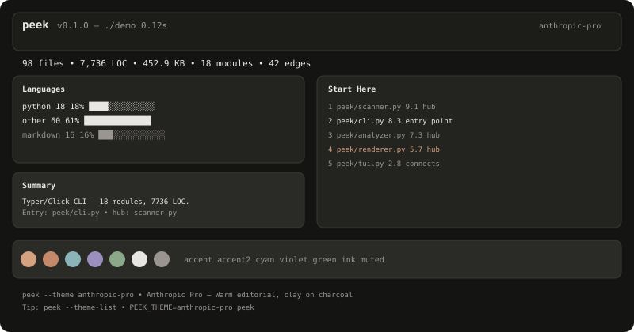
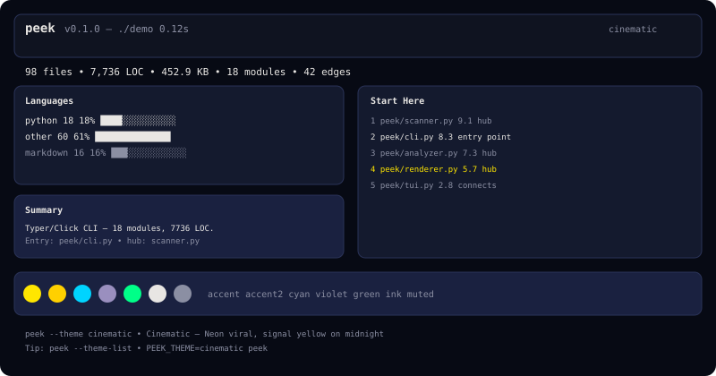
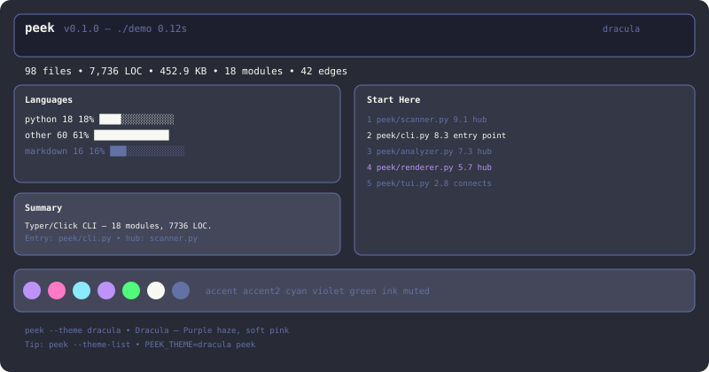
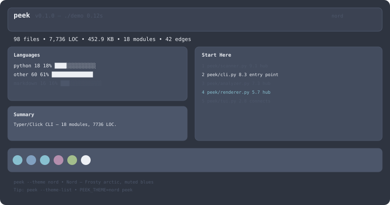
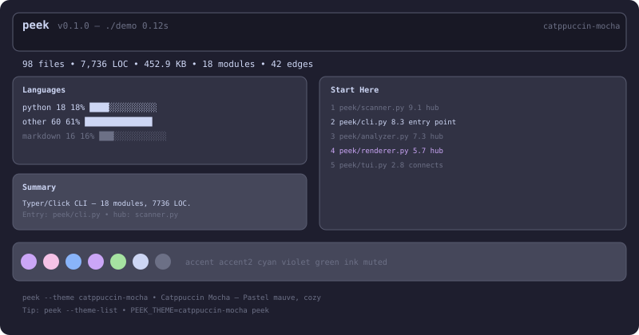
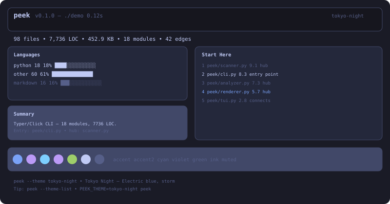
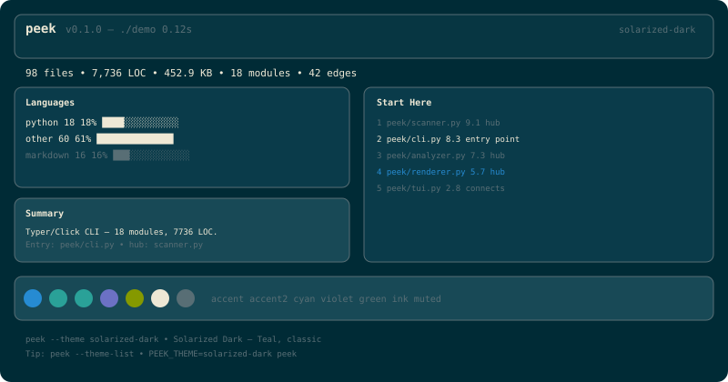
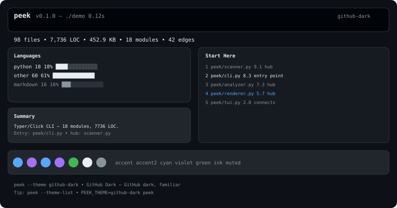
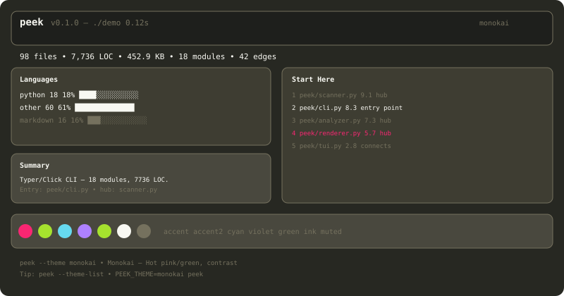
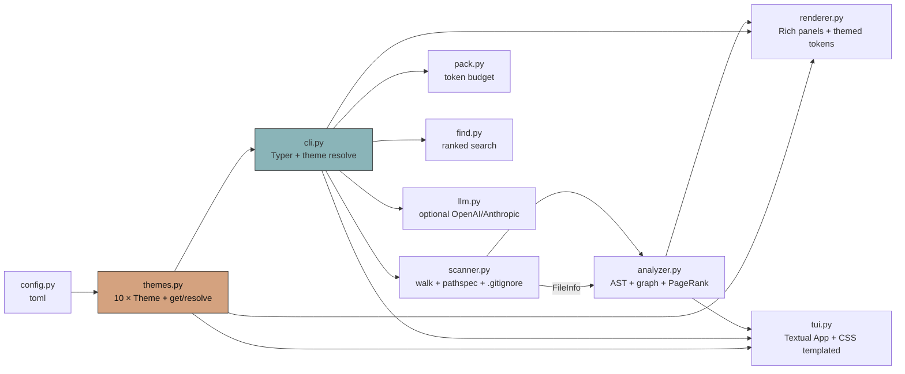

# peek — htop for codebases — Documentation

> **Understand any codebase in 5 seconds.**  
> `pip install peek && peek .` — Python-native, Rich + Textual, works offline, never crashes.

<p align="center">
  
</p>

<p align="center">
  <a href="https://pypi.org/project/peek/"></a>
  <a href="https://pypi.org/project/peek/"></a>
  
  
  
</p>

---

## Table of Contents

- [What is peek?](#what-is-peek)
- [Install](#install)
- [Demo Video](#demo-video)
- [Quick Start](#quick-start)
- [Features](#features)
- [10 Themes](#10-themes)
- [CLI Reference](#cli-reference)
- [TUI Guide](#tui-guide)
- [Pack, Find, LLM](#pack-find-llm)
- [Config](#config)
- [Architecture](#architecture)
- [Testing (TDD)](#testing-tdd)
- [Performance](#performance)
- [Troubleshooting](#troubleshooting)
- [Contributing](#contributing)

---

## What is peek?

`peek` is the **htop for codebases**. Point it at any repo — local, cloned, or `https://github.com/...` checked out — and it tells you in one screen:

- **What language is this?** (by-lang bar)
- **What stack?** (FastAPI / Django / Typer / SQLAlchemy / Next.js …)
- **Where to start?** (PageRank + in-degree + entry bonus ranked `Start Here`)
- **How is it wired?** (import graph, top hubs → deps, ASCII one-liner)
- **What’s big?** (largest files by LOC + size)

Every output is a **screenshot**: `peek --no-tui` is tweet-ready, `peek --html` is shareable, `peek` TUI is interactive.

**No API keys, no network, no setup.** Pure Python `ast` + heuristics, 2000-file cap, binary/huge/permission-safe.

---

## Install

```bash
pip install peek
# or isolated
pipx install peek
uv tool install peek

# dev (with tests + linters)
git clone https://github.com/hariomlohardev/peek && cd peek
pip install -e ".[dev]"
pytest -q  # 74 passed
```

Requires **Python 3.11+**. Deps: `typer`, `rich`, `textual`, `pathspec` — all pure Python.

---

## Demo Video

> **Generated by code** — no `vhs`/`ffmpeg` needed. `python -m peek.tools.gen_demo` renders a themed terminal in Pillow → `assets/demo.gif` (800×450, <3 MB, ~15 s, 10 fps, loop) + `assets/demo.svg` (SMIL).

<p align="center">
  
</p>

```bash
python -m peek.tools.gen_demo        # gif + svg (Pillow, 800x450)
peek --html -o peek/assets/demo.html # themed HTML
pytest peek/tests/test_demo_assets.py -v  # guards: GIF89a, <3MB, HTML exists
ls -lh peek/assets/demo.gif peek/assets/demo.svg  # verify <3MB
```

Scenes: title `htop for codebases` → `peek --help` → `peek . --no-tui` static panels → `peek find "auth"` → `peek --pack --ask auth` → `--theme-list` carousel. Colors from `peek/themes.py` (`anthropic-pro` `#D4A27F`→`#141413`). Also `vhs` fallback: `vhs peek/assets/demo.tape`.

---

## Quick Start

```bash
peek                 # TUI on current dir — q to quit, / to filter
peek .               # same, explicit path
peek /path/to/repo   # any repo
peek --no-tui        # static Rich (CI / pipe / screenshot)
peek --theme dracula # same but purple
peek --theme-list    # see all 10
```

**In 10 seconds on this repo:**

```bash
peek --no-tui
# 98 files • 7,736 LOC • 18 modules • 42 edges
# Languages: other 61% python 18% markdown 16%
# Summary: Typer/Click CLI (Rich, Textual) — Entry: peek/cli.py
# Start Here: 1 scanner.py (hub) 9.1 • 2 cli.py (entry) 8.3
```

---

## Features

| Feature | `scan` | `analyze` | `peek` (TUI) | `peek --html` | `peek --pack` |
|---------|:------:|:---------:|:------------:|:-------------:|:-------------:|
| Walk respecting `.gitignore` + defaults (`.git`, `__pycache__`, `node_modules`) | ✅ | ✅ | ✅ | ✅ | ✅ |
| Languages + LOC + by-lang bar | ✅ | ✅ | ✅ | ✅ | — |
| Tech stack (`pyproject.toml`/`package.json` deps → frameworks) | ✅ | ✅ | ✅ | ✅ | — |
| Entry points (`main.py`/`cli.py`/`__main__`/`pyproject.scripts`/`if __name__ == "__main__"`) | ✅ | ✅ | ✅ | ✅ | — |
| Import graph (AST, relative, `src/` layout, stdlib filtered) | — | ✅ | ✅ | ✅ | — |
| PageRank + in-degree + entry bonus ranking | — | ✅ | ✅ | ✅ | — |
| Heuristic summary (framework detection + hub) | — | ✅ | ✅ | ✅ | — |
| Static Rich panels | ✅ | ✅ | ✅* | ✅ | — |
| Textual TUI (nav, filter, open, 10 themes) | — | — | ✅ | — | — |
| `--html` self-contained | ✅ | ✅ | ✅ | ✅ | — |
| `--pack` / `--ask` (token budget) | — | — | ✅ | — | ✅ |
| `find` (filename + content ranked) | — | — | ✅ | — | — |
| `--llm` (OpenAI/Anthropic if key set) | — | ✅ | ✅ | — | — |

`*` static via `--no-tui`

### Why peek vs others?

| Tool | Lacks |
|------|-------|
| `gitingest` / `repomix` | No ranking, no graph, no TUI |
| `pydeps` | No summary, no entry detection |
| `tree` / `tokei` / `onefetch` | No graph, no ranking |
| `code2prompt` | Needs API, no local analysis |

---

## 10 Themes

Same layout, subtle animations (40 ms stagger, `linear` 220 ms fade) — only colors change. Default is **`anthropic-pro`** (warm clay on charcoal, professional).

```bash
peek --theme dracula              # one-shot
peek --theme nord --no-tui        # static themed
peek --theme dracula --html -o out.html  # themed HTML
PEEK_THEME=tokyo-night peek        # env
echo 'theme = "dracula"' > ~/.peek/config.toml  # persistent
peek --theme-list                 # list all 10
```

Precedence: `cli --theme` > `PEEK_THEME` env > `config.toml` > `anthropic-pro`. Bad name → `exit 2` + `Available: ...`.

| # | ID | Label | Accent → Bg | Vibe | Preview |
|---|----|-------|-------------|------|---------|
| 1 | `anthropic-pro` | Anthropic Pro | `#D4A27F` → `#141413` | Warm editorial, default |  |
| 2 | `cinematic` | Cinematic | `#FFE600` → `#070A14` | Neon viral |  |
| 3 | `dracula` | Dracula | `#BD93F9` → `#282A36` | Purple haze |  |
| 4 | `nord` | Nord | `#88C0D0` → `#2E3440` | Arctic calm |  |
| 5 | `catppuccin-mocha` | Catppuccin Mocha | `#CBA6F7` → `#1E1E2E` | Pastel cozy |  |
| 6 | `tokyo-night` | Tokyo Night | `#7AA2F7` → `#1A1B26` | Electric storm |  |
| 7 | `solarized-dark` | Solarized Dark | `#268BD2` → `#002B36` | Teal classic |  |
| 8 | `github-dark` | GitHub Dark | `#58A6FF` → `#0D1117` | Familiar OSS |  |
| 9 | `monokai` | Monokai | `#F92672` → `#272822` | Hot pink pop |  |
| 10 | `minimal-mono` | Minimal Mono | `#E5E5E5` → `#111111` | Grayscale a11y |  |

Each theme has 15 tokens: `bg`, `bg2`, `surface`, `panel`, `line`, `line2`, `ink`, `ink2`, `muted`, `muted2`, `accent`, `accent2`, `cyan`, `violet`, `green`. All validated at import (`#RRGGBB`, exactly 15).

**Screenshots:** All previews are generated SVGs (800×420) from `peek/assets/themes/*.svg` — they mimic the real TUI header, stats, Languages, Summary, Start Here, palette strip, and tip. Export your own:

```bash
for t in anthropic-pro cinematic dracula nord catppuccin-mocha tokyo-night solarized-dark github-dark monokai minimal-mono; do
  peek --theme $t --no-tui > /tmp/$t.txt
  peek --theme $t --html -o /tmp/$t.html && echo "→ /tmp/$t.html"
done
```

---

## CLI Reference

```
peek [PATH] [OPTIONS] [COMMAND]

Options:
  -V, --version          Show version and exit
  --no-tui               Static output only (no TUI) — pipeable
  --html                 Export to HTML (with -o)
  -o, --output PATH      Output file for --html / --pack
  --pack                 LLM pack: concatenate top files
  --ask TEXT             Filter --pack by keyword
  --llm                  Try LLM summary if OPENAI_API_KEY / ANTHROPIC_API_KEY set
  --find TEXT            Find keyword (alias for peek find)
  --theme TEXT           Theme id (see --theme-list)
  --theme-list           List themes and exit
  --help                 Show help

Commands:
  scan [PATH]            Scan + stats, tech stack, entry points
    --max-files 2000     Hard cap
    --json               JSON output
    --html / -o          HTML export
    --theme TEXT         Themed

  analyze [PATH]         Graph + ranking + summary
    --max-files, --json, --html, -o, --llm, --theme

  find <query> [PATH]    Find by filename + content, ranked
    --limit 20 --json --max-files

Examples:
  peek
  peek --no-tui
  peek scan . --json | jq .stats
  peek analyze . --html -o report.html
  peek --theme dracula --no-tui
  peek --pack --ask "auth" -o pack.txt
  peek find "token" . --limit 10
  PEEK_THEME=nord peek
```

- **Windows:** UTF-8 forced, `/tmp/foo.html` on win32 maps to `%TEMP%/foo.html` via `_write_output_safely`, `mkdir -p` for `-o`.
- **Exit codes:** `0` ok, `1` analyze fail, `2` unknown theme.

---

## TUI Guide

```
peek                  # launches TUI (default)
peek --theme dracula  # themed TUI
```

**Layout:** `Header` (peek v + path + time + theme) | `stats` | `Languages` | `Summary` | `Tech Stack` | `Start Here` (ranked) | `Import Graph` | `Largest Files` → right pane `Start Here` list + `Detail` bottom.

**Keys:**

| Key | Action |
|-----|--------|
| `q` / `Ctrl+C` | Quit |
| `j` / `k` / `↑` / `↓` | Navigate Start Here |
| `Enter` | Show details toast (score + reasons) |
| `o` | Open highlighted file in `$EDITOR` / `$VISUAL` / `notepad` |
| `/` | Filter Start Here (fuzzy on `rel` + reasons), `Enter` apply, `Esc` clear |
| `?` | Help toast (theme + keys) |
| `Esc` | Clear filter if visible |

**Filter:** Type `auth`, `cli`, `graph` — list updates live with 12 ms stagger, detail follows first match. No match → placeholder `No files — try filter`.

**Animations:** Panels fade `opacity 0→1 220ms linear` (right `+60ms` delay), detail `180ms`, list items `160ms` + `12ms` stagger, spinner `dots` in theme `accent`. All `linear` (Textual valid, not `ease-out`).

**Fallbacks:** No `textual` installed → static Rich + hint `pip install textual`. Not a tty (`isatty` false) → static. `asyncio` imported at top — filter no longer `NameError`.

---

## Pack, Find, LLM

```bash
# Pack — smart concatenation for LLMs, respects token budget (default 8000, ~len/4 est)
peek --pack                     # stdout → | pbcopy / clip / xclip
peek --pack --ask "auth"        # only files matching auth (filename + content + analyzer bonus)
peek --pack -o pack.txt         # to file via safe writer
peek --pack --ask "nope" -o out.txt  # no match → graceful yellow warning

# Find — ranked filename (10) + exact (5) + content (min5+occ*0.5 capped8) + analyzer*0.3, preview 3 lines
peek find "auth" .
peek find "validate_token" . --limit 5 --json
peek --find "auth" .  # alias via main_callback

# LLM — heuristic first, LLM optional
export OPENAI_API_KEY=sk-...  # or ANTHROPIC_API_KEY
peek --llm                # tries openai>=1.0 then 0.x then anthropic, fallback heuristic
peek analyze . --llm
```

---

## Config

```toml
# ~/.peek/config.toml  OR  ~/.config/peek/config.toml  OR  $XDG_CONFIG_HOME/peek/config.toml
# OR  $PEEK_CONFIG=/path/to/config.toml

theme = "dracula"  # any of 10 ids, case-insensitive, _ or - normalized
```

- Missing / malformed TOML → silently ignored (tolerant), falls back to `anthropic-pro`.
- `tomllib` (3.11+) with `tomli` fallback.
- No auto-write; explicit `echo 'theme = "dracula"' > ~/.peek/config.toml`. Future `peek theme set dracula` planned.
- Precedence proof via `test_resolve_precedence` (cli > env > config > default).

---

## Architecture



**Key files:**

| File | Owns |
|------|------|
| `peek/peek/themes.py` | `Theme` dataclass, `THEMES: dict[str,Theme]` (10), `get_theme` (case-insensitive, `_`→`-`, `ValueError` if unknown), `list_themes` sorted, `resolve_theme` precedence, import-time validation (15 keys, `#RRGGBB`) |
| `peek/peek/config.py` | `config_path()` (PEEK_CONFIG > XDG > `~/.config/peek` > `~/.peek`), `load_config()` tolerant |
| `peek/peek/scanner.py` | `scan(root, max_files)` manual stack, skip `DEFAULT_IGNORE_DIRS` + `pathspec gitwildmatch`, `_is_binary` null-byte, `_count_loc`, `_language_for`, `detect_tech_stack` (PEP 621/poetry, `package.json`, `requirements`), `detect_entry_points` scoring, never crashes |
| `peek/peek/analyzer.py` | `_module_name_for` (`src/` strip), `_relative_base`, `_extract_raw_imports` (level), `_resolve_local_import` (exact/parent/suffix), `build_graph` (stdlib filtered via `sys.stdlib_module_names`, self-loop skip), `build_reverse_graph`, `_pagerank` (5 iter, damping 0.85), `_has_main_guard` (AST `__name__=="__main__"` + `def main`), `rank_files` (pr_norm*5 + in_norm + entry 5.0 + guard 0.5 + depth −3 for `__init__` −1.5 for <10 LOC), `summarize` |
| `peek/peek/renderer.py` | Themed helpers (`_tokens`, `_theme_label`), `make_header`…`make_graph_panel`, `render_static` (stagger `40/30/30/30/30/20 ms` when TTY), `build_html` (embeds `bg`/`accent`), keeps `ANTHRO` alias for compat |
| `peek/peek/tui.py` | `PeekApp` (theme-templated `self.CSS` with `linear` easing, fade `220ms`/`180ms`/`160ms`, stagger `0.016+idx*0.008`, filter `_apply_filter` with `asyncio` at top), `run_tui` fallback to static |
| `peek/peek/cli.py` | `ANTHRO_CLI` + `_theme_accent`, `_scan_with_spinner` (Rich `Progress` `SpinnerColumn(spinner_name="dots", style=accent)` + `threading` 0.12 s min visible), `_write_output_safely` (win32 `/tmp` → `tempfile.gettempdir()`, `mkdir -p`, fallback `peek.html`), `_should_animate`, `scan_command`/`analyze_command`/`find_command`/`main_callback` (theme resolve, `--theme-list` table, theme threading) |
| `peek/peek/animations.py` | `_tok`, `anthropic_header`, `scan_progress` (themed `Progress`) |

---

## Testing (TDD)

**Iron law:** No production code without a failing test first — watched fail, minimal green, refactor.

```bash
pytest -q          # 74 passed, 1 skipped
pytest -v
pytest peek/tests/test_comprehensive_tdd.py -v  # 29 passed, 1 skipped in that file alone
```

| Suite | Count | What it proves |
|-------|-------|----------------|
| `test_scanner.py` | 8 | empty, ignores, gitignore, binary/huge, symlink, max_files, tech/entry, never crashes |
| `test_analyzer.py` | 9 | simple graph, relative, circular, syntax error, non-python, empty, frameworks, entry bonus, BOM |
| `test_renderer_pack_find.py` | 12 | render no crash, html contains, scan-only, estimate_tokens, pack basic/query/budget, find filename/content/no-match/empty, llm fallback, cli import |
| `test_themes.py` | 14 | 10 registry, tokens shape, case-insensitive, unknown raises, fallback, resolve precedence, config missing, toml parse, render/html per-theme, tui CSS, cli list + unknown, backwards compat |
| `test_comprehensive_tdd.py` | 29 +1 skip | All of above plus CLI integration (`--version`/`--help`/`--theme`/`--theme-list`/`scan`/`analyze` `--json`/`--html`/`find`/`pack`/`--no-tui` + env, `_write_output_safely`, animations/ascii, `run_tui` fallbacks) |
| `test_demo_assets.py` | 2 | GIF valid (`GIF89a`, <3 MB, >5 KB), HTML exists (`<html`) |

**TDD story:** Added `test_comprehensive_tdd.py` → first run 2 failures (`gitignore` `.git` substring + `SpinnerColumn(spinner=)` typo) → minimal fixes → green. Added `test_css_parse` for `ease-out` → `linear` → verified via `Stylesheet().add_source`. Added `test_tui_filter_asyncio` for `NameError: asyncio` → added `import asyncio` at top.

Output pristine except `pathspec` deprecation warnings (dep, not our code).

---

## Performance

- `< 0.2 s` for peek itself (98 files, 7,736 LOC, 18 modules, 42 edges)
- `< 1 s` for 500-file repos, hard cap 2000 (`truncated` flag)
- `scan` with `pathspec` + manual stack, `analyze` 5-iter PageRank, `render_static` no `Live` (just `time.sleep` stagger)

---

## Troubleshooting

| Symptom | Fix |
|---------|-----|
| `CSS parsing failed: expected easing function; found 'ease-out'` | Fixed in `themes-10` `8dfb76a` — use `linear` |
| `NameError: asyncio is not defined` in filter | Fixed in `2b55926` — `import asyncio` at top |
| `FileNotFoundError: '\\tmp\\cinematic.html'` on Windows | Fixed — `_write_output_safely` maps `/tmp` → `%TEMP%` |
| `cp1252 █` `UnicodeEncodeError` | `sys.stdout.reconfigure(utf-8)` + `legacy_windows=False` |
| No TUI, just static | Install `pip install textual` or use `peek --no-tui` |
| `Unknown theme 'foo'` `exit 2` | Check `peek --theme-list`, case-insensitive, `-`/`_` normalized |

---

## Contributing

See `peek/CONTRIBUTING.md`. PRs welcome — add tests per TDD. Branch `polish-100` is latest (from `themes-10` → `main`), local commits only, no push. Run `ruff`, `pytest -q` (74 passed) before PR.

## License

MIT — `peek/LICENSE`. Author **Hariom Lohar** — hariomlohar.new@gmail.com — [hariomlohardev.github.io](https://hariomlohardev.github.io/)

---

*Docs generated 2026-08-11 on branch `polish-100`. Theme previews in `peek/assets/themes/*.svg` (800×420). For the 5-day build story see `docs/research/06_five_day_build_plan.md` and `docs/research/08_launch_playbook.md`.*
