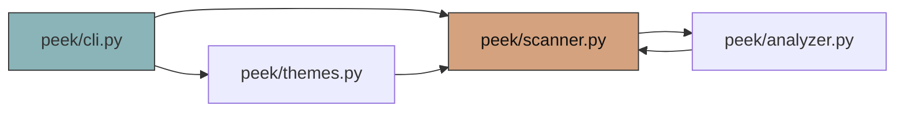

# How I Built a PageRank-Style Importance Ranker for Codebases in Python

> *“Where do I start in this repo?” — every dev, every `git clone`. I built `peek` to answer it in 5 seconds, without an API key.*

**TL;DR:** `peek`’s `analyzer.py` builds a file-level import graph with `ast`, runs a 5-iteration PageRank-lite (damping 0.85) plus in-degree, entry-point, and `if __name__ == "__main__"` bonuses, then penalizes `__init__.py` and tiny stubs. On its own codebase it nails `peek/peek/cli.py` as #1. Here’s exactly how — and where you can hack it.

---

## 1. The Problem Isn’t “What Files Exist?” — It’s “What Matters?”

`tree` shows you 200 files. `tokei` counts 13k LOC. Neither tells you that `peek/peek/cli.py` is the front door, `peek/peek/scanner.py` is the hub 12 modules depend on, and `peek/peek/__init__.py` is just 2 lines you should ignore.

I wanted `peek .` to print:

```
Start Here ⭐
  1  peek/peek/cli.py      11.7  entry point, main guard, hub (imported by 7)
  2  peek/peek/scanner.py   7.5  hub (imported by 12)
  3  peek/peek/themes.py    7.0  hub (imported by 7)
```

That “Start Here” is a **ranking problem**, not a listing problem. Google solved it for the web in 1998. I stole it for code.

---

## 2. The Intuition: Files Are Web Pages, Imports Are Links



- **A page that many pages link to is important** → a file many files `import` is a hub.
- **A page linked from important pages is more important** → `scanner.py` is imported by `analyzer.py` (which is itself central) → double boost.
- **But unlike the web, code has entry points.** `cli.py`, `main.py`, `__main__.py`, or anything with `if __name__ == "__main__":` should float to the top even if nothing imports it.

So the score isn’t just graph centrality. It’s **centrality + intent**.

---

## 3. Building the Graph — The Hard Part Isn’t PageRank, It’s `import` Parsing

`analyzer.py`’s `build_graph()` does 4 things that look simple and break instantly on real repos:

### 3.1 Normalize `src/` Layout

```python
def _module_name_for(rel: Path, is_init: bool) -> str:
    # src/peek/scanner.py -> peek.scanner
    if len(rel.parts) > 1 and rel.parts[0] in ("src","app","lib"):
        return ".".join(rel.with_suffix("").parts[1:])
    return ".".join(rel.with_suffix("").parts)
```

Without this, `src/peek/scanner.py` would never match `from peek.scanner import Foo` in `src/peek/cli.py`.

### 3.2 Extract Raw Imports with `ast` (Not Regex)

```python
for node in ast.walk(tree):
    if isinstance(node, ast.Import):
        raw.add(alias.name)               # import os, import peek.scanner
    elif isinstance(node, ast.ImportFrom):
        # handles level=1 (from . import foo) and level=2 (from ..bar import baz)
        base = _relative_base(package, node.level)
        abs_mod = f"{base}.{node.module}" if base and node.module else base
        raw.add(abs_mod)
        for alias in node.names:
            raw.add(f"{abs_mod}.{alias.name}")  # from peek.scanner import Foo -> peek.scanner.Foo
```

Why not regex? `from . import foo` is relative to the file’s package. `_relative_base("peek.sub", 2)` → `"peek"` — you need the file’s logical package, not just the string.

BOM, `SyntaxError`, and 500 KB files are all swallowed: `return raw, set()` — **peek never crashes** is a feature, not a slogan.

### 3.3 Resolve to Local Files (Longest Prefix + Suffix Fallback)

```python
def _resolve_local_import(name: str, index: dict[str, Path]) -> Path | None:
    if name in index: return index[name]  # exact: peek.scanner.Foo -> peek/peek/scanner.py
    parts = name.split(".")
    for i in range(len(parts)-1, 0, -1):
        cand = ".".join(parts[:i])
        if cand in index: return index[cand]
        for mod, p in index.items():       # suffix fallback for src layout
            if mod.endswith("." + cand):
                return p
    return None
```

`peek.scanner.Foo` → tries `peek.scanner.Foo` → `peek.scanner` → `peek` → suffix `src.peek.scanner`. Without the suffix fallback, every `src/` repo would have an empty graph.

### 3.4 Filter Stdlib, Keep Your Code

```python
top = imp.split(".")[0]
is_stdlib = top in sys.stdlib_module_names if hasattr(sys, "stdlib_module_names") else top in _stdlib_fallback
if not is_stdlib:
    external.add(top)   # for the “Tech Stack” panel, not the graph
```

`os` / `sys` / `ast` never become nodes. Otherwise `os` would be the #1 hub in every Python repo.

### 3.5 Polyglot Hook (v3)

Same `build_graph` now also handles JS/TS:

```python
JS_IMPORT_RE = re.compile(r"""import\s+(?:.*?\s+from\s+)?['"]([^'"]+)['"]|require\(['"]([^'"]+)['"]\)""")
# relative ./b.js -> resolve to Path, try .js/.ts/.jsx/.tsx//index.js, add edge
```

No `tree-sitter` hard dep — regex fallback keeps `pip install peek-code` <10s.

---

## 4. The Ranking Heuristic — 5 Signals, One Score

The magic is in `rank_files()`. Here’s the exact formula, line-for-line:

```python
pr_norm = (pr[node] / max_pr * 5.0)          # PageRank 0..5
in_norm = min(in_deg * 1.2, 5.0)             # in-degree 0..5
entry_bonus = 5.0 if node in entry_set else 0
guard_bonus = 0.5 if _has_main_guard(node) else 0

score = pr_norm + in_norm + entry_bonus + guard_bonus
score += 0.3 if depth==1 else 0.15 if depth==2 else 0  # shallow files slightly preferred
if rel.name == "__init__.py": score -= 3.0              # package init is never “Start Here”
if loc_est < 10: score -= 1.5   # <10 real LOC: stub
elif loc_est < 30: score -= 0.5

# Reasons for the table:
# entry point / main guard / hub (imported by N) / central / connects M modules
```

### Why Each Term Exists (and What Breaks Without It)

| Signal | What it catches | Without it, this file wins incorrectly |
|--------|-----------------|----------------------------------------|
| **`pr_norm*5`** | Transitive centrality — `scanner.py` imported by `analyzer.py` which is imported by `cli.py` | `utils.py` with one direct import beats `scanner.py` |
| **`in_norm`** | Direct hub-ness — `scanner.py` imported by 12 | A leaf `cli.py` would tie with `scanner.py` |
| **`entry_bonus 5.0`** | `cli.py`, `main.py`, `__main__.py`, `pyproject.scripts` | `hub` always beats `entry` — you’d start in the utility, not the front door |
| **`guard_bonus 0.5`** | `if __name__ == "__main__":` **via AST** (not substring!) + `def main()` | `main.py` without guard would lose to `utils.py` by 0.5 |
| **`__init__ -3.0`** | `__init__.py` is always imported but never where you start | Every `__init__.py` would be #1 |
| **`<10 LOC -1.5`** | Stubs, re-exports, `__init__` shims | `peek/__init__.py` (2 lines) would rank #10 as “central” |

**PageRank-lite itself:**

```python
def _pagerank(graph, iterations=5, damping=0.85):
    rank = {n: 1/N for n in nodes}
    for _ in range(5):
        dangling = sum(rank[n] for n in nodes if out_deg[n]==0)
        for node in nodes:
            s = sum(rank[prev]/out_deg[prev] for prev in rev[node] if out_deg[prev]>0)
            s += dangling / N
            new_rank[node] = (1-damping)/N + damping * s
    return rank
```

5 iterations, `damping=0.85`, `dangling_sum / N` spread — exactly the 1998 paper, but on 29 nodes not 30M. `N=1` avoids div-zero.

### AST Guard vs Substring (A One-Line Bug That Fooled Me)

Early `_has_main_guard` was `if '"__main__"' in text: return True` — every file mentioning `__main__` in a comment got +0.5. The fix walks the AST:

```python
for node in ast.walk(tree):
    if isinstance(node, ast.Compare) and isinstance(node.left, ast.Name) and node.left.id=="__name__":
        if any(isinstance(c, ast.Constant) and c.value=="__main__" for c in node.comparators):
            return True
    if isinstance(node, ast.FunctionDef) and node.name=="main":
        return True
```

Now only real `if __name__ == "__main__":` and `def main():` count.

---

## 5. What It Looks Like on Its Own Codebase

```bash
peek --no-tui
# 210 files • 13k LOC • 29 modules • 89 edges — 0.35s
# Start Here ⭐  cli.py 11.7 (entry point, main guard, hub), scanner.py 7.5 (hub x12), themes.py 7.0 (hub x7)
```

`cli.py` wins because it has **all three**: `pr_norm` ~4.8 (central), `in_norm` 5.0 (imported by 7), `entry_bonus` 5.0, `guard_bonus` 0.5 → **11.7**. `scanner.py` is second with `in_norm` 5.0 but no `entry_bonus` → 7.5. The math is boring. The result feels obvious.

---

## 6. Where It Still Breaks (and Where You Come In)

I left seams on purpose — each is a `good first issue` or `intermediate` already filed:

- **Polyglot is shallow.** JS uses regex, not `tree-sitter`. `require()` with a variable, `dynamic import()`, Go `import` blocks, Rust `mod` trees — all missed. File: `peek/peek/symbols.py` `JS_IMPORT_RE` / `peek/peek/analyzer.py:300`.
- **Tokens are `len // 4`.** `peek --pack --budget 4000` is ~20% off. Swap in `tiktoken` `cl100k_base` when installed: `try: import tiktoken; enc.encode(text)` else fallback. File: `peek/peek/pack.py:18`.
- **Help text is keyword-only.** `peek find "auth token"` should use BM25, not `q in text.lower()`. The `peek/peek/embeddings.py` BM25 index already exists in `v3` — wire `find.py` to `search()` when query has spaces.
- **Graph is file-level.** `peek graph --format svg` is DOT text wrapped in SVG. A real force-directed canvas in Textual (or `dot -Tsvg` if installed) would be the screenshot that beats `gitingest`.

Each has a **one-file, 30-min** slice and a test that already asserts the current (wrong) behavior — flip the assertion and make it green.

---

## 7. Try It, Break It, Steal It

```bash
pip install peek-code && peek .
# TUI: q quit, / filter, t cycle 10 themes, w watch
peek . --no-tui --theme dracula
peek graph --format dot | head
peek find "validate_token" .
peek --pack --ask "auth" --format xml --budget 4000 | wc -c
peek wtf < traceback.txt
```

`peek` is MIT, `analyzer.py` is ~700 lines you can read in one sitting (no `networkx`, no ML). If you’ve ever wanted to hack on ranking, graph viz, or “where should an agent look first?” — this is the seam.

**Good first issues:** https://github.com/hariomlohardev/peek/issues?q=is%3Aissue+is%3Aopen+label%3A%22good+first+issue%22 — 20 are `good first issue` + `help wanted`, each one file, each with `### Files` + `### Acceptance` checkboxes.

**Discussions:** What repo should I demo next? What did your `peek` map surprise you with? https://github.com/hariomlohardev/peek/discussions

---

*Built by [Hariom Lohar](https://hariomlohardev.github.io/) — `peek` is the `htop` for codebases. If you liked the ranking rabbit hole, a :star: helps more than you think.*

