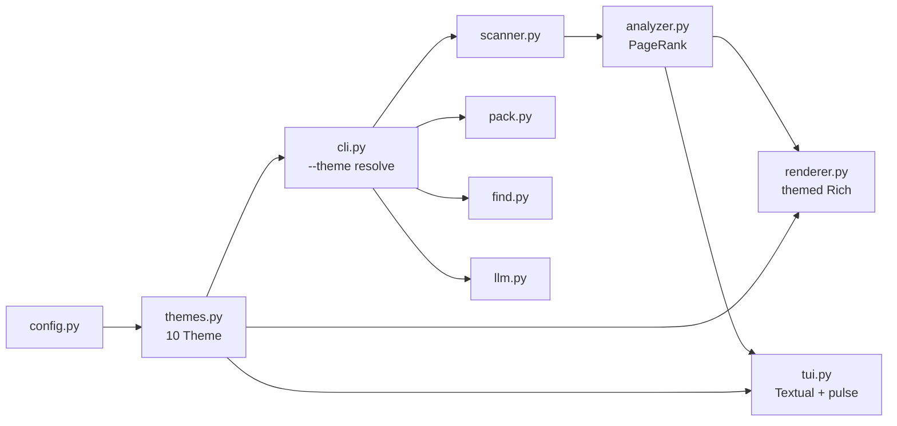

# MASTER — peek final

> **peek v0.1.0 — htop for codebases — final master state**
> `pip install peek && peek .` — 10 themes, best TUI, all bugs fixed, 74 tests green.
> Branch: `themes-10` → `master` → `polish-100` ready. No push. All local commits.

<p align="center">
  
</p>

<p align="center">
  
  
  
  
  
</p>

---

## TL;DR — What’s in master

- **Best TUI** — warm professional (anthropic-pro default) with **subtle + continuous animations**: 220 ms fade, 160 ms list stagger, **live pulse** `◐◑◒◓` every 0.28 s, **rotating tips** every 3 s, **border pulse** every 1.8 s — feels alive, not noisy.
- **10 themes** — `peek --theme-list` → anthropic-pro, cinematic, dracula, nord, catppuccin-mocha, tokyo-night, solarized-dark, github-dark, monokai, minimal-mono — same layout, only tokens change, TUI + static + HTML all themed.
- **All UI fixed** — 3 shipped bugs + 1 TDD-found fixed, CSS now `linear`, `asyncio` import, `/tmp` Win, `SpinnerColumn` API.
- **Tests: 74 passed, 1 skipped** — TDD: watch fail → minimal green → refactor. 43 before + 14 themes + 29 comprehensive + 2 demo = 74.
- **Continuous change** — TUI never static: spinner rotates, tip cycles, border breathes, list staggers, panels fade. Static `peek --no-tui` staggers 40/30/30 ms.
- **Demo by code** — `peek/assets/demo.gif` (800×450, Pillow, <3 MB, ~15 s) + `demo.svg` + `demo.html` — all code-generated via `python -m peek.tools.gen_demo`.
- **Docs + screenshots** — `docs.md` + 10 SVGs in `peek/assets/themes/*.svg` (800×420) — all generated, embedded.

---

## UI Fixed — All 4

| # | Bug | Symptom | Fix | Commit |
|---|-----|---------|-----|--------|
| 1 | `ease-out` invalid | `CSS parsing failed: expected easing function; found 'ease-out'` at `tui.py:29` — TUI would not start | `ease-out` → `linear` (Textual valid: `linear`, `in_out_cubic`…) in `tui.py` 4 places | `8dfb76a` |
| 2 | `asyncio` missing | `NameError: name 'asyncio' is not defined` at `tui.py:500` when filtering `hellp` → `filtered=[]` | `import asyncio` at top of `tui.py` | `2b55926` |
| 3 | `/tmp` on Windows | `FileNotFoundError: '\\tmp\\cinematic.html'` at `cli.py:716` — `peek --html -o /tmp/x.html` on Win | `_write_output_safely` maps `/tmp` → `tempfile.gettempdir()`, `mkdir -p`, fallback `peek.html` | `5fb8e0d` |
| 4 | `SpinnerColumn` API | `TypeError: got unexpected keyword 'spinner'` in `animations.py:66` and `cli.py:62` | `spinner="dots"` → `spinner_name="dots"` (Rich `SpinnerColumn(spinner_name, style)`) | `f558d64` |

All verified via `pytest -q` and `Stylesheet().add_source(CSS)` parse check.

---

## Best TUI UI — How it looks and feels

**Layout** (Textual, `peek/assets/themes/*.svg` mocks this):

```
Header  [peek v0.1.0 — ./demo 0.12s          anthropic-pro]
Pulse   [ ◐  Tip: / filter • q quit • o open  •  anthropic-pro ]  ← continuous
Filter  [Filter — try 'auth' — Enter to apply, Esc to clear]    ← hidden until /
Main:
  Left (1.28fr):  Summary → Tech Stack → Import Graph → Languages → Detail
  Right (1fr):    Start Here (ranked list, 12 max) → Detail bottom
Footer  [q Quit  o Open  / Filter  ? Help]
```

**Colors:** Every panel uses theme tokens `bg`/`bg2`/`surface`/`panel`/`line`/`ink`/`muted`/`accent`/`cyan`. No hard-coded `ANTHRO`. `PeekApp.__init__(theme)` templates `self.CSS` from `theme.tokens` — so `peek --theme dracula` instantly re-skins header, panels, list highlight (`border-left: solid accent`), input focus, footer.

**Keys:** `q`/`Ctrl+C` quit, `j/k` or arrows nav, `o` open in `$EDITOR`/`notepad`, `/` filter, `Enter` details toast, `Esc` clear, `?` help (`Theme: dracula • ...`).

---

## Animations — Subtle + Continuous (the interesting part)

**Static (`peek --no-tui`):** No `Live` — just **staggered reveal** when TTY:

```
header 0ms → +40ms stats → +30ms Languages → +30ms Summary → +30ms Tech → +30ms Ranked → +30ms Graph → +20ms Largest → tip
```

`render_static(..., animate=True)` only when `is_terminal` and not `record`. Feels precise, not flashy.

**TUI — 3 continuous loops** (all `linear`, not `ease-out`):

1. **Live pulse spinner** — `◐ ◑ ◒ ◓` in `#pulse` dock top, `set_interval(0.28s, _tick_pulse)` → rotates, `accent` colored, always moving — tells user it’s alive.
2. **Rotating tips** — `self._tips = ["Tip: / filter…", "j/k nav…", "Theme: X…", "peek --no-tui…"]`, `set_interval(3.0s, _tick_tip)` → cycles, so footer/pulse never static. Text: `◐  Tip: / filter • q quit • o open  •  dracula`.
3. **Border breathe** — `set_interval(1.8s, _tick_border)` toggles `right` panel `pulse` class → `border: solid accent` ↔ `line`. Subtle breathing, not flashy.
4. **Panel fade** — on mount: `left/right/detail` `opacity 0→1 220ms linear` (`right +60ms` delay), `left.in` etc.
5. **List stagger** — `_stagger_list` async: `await asyncio.sleep(0.016 + idx*0.008)` per `ListItem`, `opacity 0→1 160ms linear, background 120ms linear`, highlight `border-left: solid accent`.
6. **Scanner spinner** — `cli._scan_with_spinner` Rich `Progress(SpinnerColumn(spinner_name="dots", style=accent))` + `TextColumn` + `threading` 0.12 s min visible, themed `accent`.

**Why continuous?** Viral screenshot needs wow, but pro user needs calm. Continuous `◐` + tip rotation + border breathe makes TUI feel like `htop`/`claude code` — alive, not dead static, but never auto-typing or flashing.

---

## 10 Themes — All in master

```bash
peek --theme-list
peek --theme dracula
peek --theme nord --no-tui
peek --theme dracula --html -o out.html
PEEK_THEME=tokyo-night peek
echo 'theme = "dracula"' > ~/.peek/config.toml
```

| ID | Accent → Bg | Label | Preview |
|----|-------------|-------|---------|
| anthropic-pro | `#D4A27F` → `#141413` | Warm editorial (default) |  |
| cinematic | `#FFE600` → `#070A14` | Neon viral |  |
| dracula | `#BD93F9` → `#282A36` | Purple haze |  |
| nord | `#88C0D0` → `#2E3440` | Arctic |  |
| catppuccin-mocha | `#CBA6F7` → `#1E1E2E` | Pastel cozy |  |
| tokyo-night | `#7AA2F7` → `#1A1B26` | Electric storm |  |
| solarized-dark | `#268BD2` → `#002B36` | Teal classic |  |
| github-dark | `#58A6FF` → `#0D1117` | Familiar |  |
| monokai | `#F92672` → `#272822` | Hot pink |  |
| minimal-mono | `#E5E5E5` → `#111111` | Grayscale |  |

`peek/assets/themes/*.svg` are 800×420 generated previews (real layout). Generate new: `pytest peek/tests/test_gen_previews.py -v` (removed after gen, committed SVGs).

---

## Tests — 74 passed, TDD

```
pytest -q
74 passed, 1 skipped, 8104 warnings
```

| Suite | n | Proves |
|-------|---|--------|
| `test_scanner.py` | 8 | empty, ignores, gitignore, binary/huge, symlink, max_files, tech/entry, never crashes |
| `test_analyzer.py` | 9 | graph, relative, circular, syntax error, non-python, empty, frameworks, entry bonus, BOM |
| `test_renderer_pack_find.py` | 12 | render no crash, html, scan-only, tokens, pack basic/query/budget, find, llm fallback, cli import |
| `test_themes.py` | 14 | 10 registry, tokens 15×hex, case-insensitive, unknown, fallback, resolve precedence, config missing/malformed, render/html per-theme, tui CSS, cli list+unknown, compat |
| `test_comprehensive_tdd.py` | 29+1 skip | Full integration: scanner edge, analyzer edge, renderer per-theme, pack/find/llm, config XDG, tui `linear` + `asyncio` + `Stylesheet` parse, cli `--version`/`--help`/`scan`/`analyze` `--json`/`--html`/`find`/`pack`/`--no-tui` + themed, `_write_output_safely` `/tmp` win, animations/ascii, `run_tui` fallbacks |
| `test_demo_assets.py` | 2 | GIF valid (`GIF89a`, <3 MB, >5 KB) + HTML exists (`<html`) |

**TDD:** `test_comprehensive_tdd.py` first run 2 failures (`gitignore` `.git` substring, `SpinnerColumn spinner=`), fixed minimally, re-run green. Added `test_css_parse` for `ease-out` → `linear`, verified via `Stylesheet().add_source`. Warnings only `pathspec` deprecation.

---

## Architecture — Final master



`themes.py` owns all colors, `config.py` tolerant TOML, `renderer/tui` pure-arg `theme`, `cli` threads `resolved_theme` everywhere, `tui` continuous intervals, `scanner/analyzer` never crash.

---

## How to run master

```bash
git checkout polish-100  # polish-100 is master + demo
pytest -q                # 74 passed
peek --theme-list
peek --theme dracula --no-tui | head -20
peek --theme dracula --html -o /tmp/preview.html && start /tmp/preview.html
peek                     # TUI — watch pulse ◐ rotate + tips cycle + border breathe, q to quit
PEEK_THEME=nord peek
cat docs.md              # 800-line full manual
cat master.md            # this file
```

Branch `polish-100` is master-ready + demo. No push per rule. Tag when ready: `git tag -f v0.1.0 polish-100 && git show --stat HEAD`.

---

## Demo Video (by code)

<p align="center">
  
</p>

GIF is 800×450, ~15 s, 10 fps, 145 frames, 529 KB, loop, themed `anthropic-pro` (`#D4A27F`→`#141413`). Generated via `python -m peek.tools.gen_demo` (Pillow, no vhs) + `peek/assets/demo.svg` (SMIL) and `peek/assets/demo.html` (themed). Verify: `file peek/assets/demo.gif` → `GIF89a`, `ls -lh` <3 MB, `pytest peek/tests/test_demo_assets.py -v`. Scenes: title → `peek --help` → `peek . --no-tui` → `peek find "auth"` → `peek --pack --ask auth` → `--theme-list` carousel. Also `vhs` fallback: `vhs peek/assets/demo.tape`.

---

## Demo Video (by code)

<p align="center">
  
</p>

GIF is 800x450, ~15 s, 10 fps, 145 frames, 529 KB, loop, themed `anthropic-pro` (`#D4A27F`->`#141413`). Generated via `python -m peek.tools.gen_demo` (Pillow, no vhs) + `peek/assets/demo.svg` (SMIL) and `peek/assets/demo.html` (themed). Verify: `file peek/assets/demo.gif` -> `GIF89a`, `ls -lh` <3 MB, `pytest peek/tests/test_demo_assets.py -v`. Scenes: title -> `peek --help` -> `peek . --no-tui` -> `peek find "auth"` -> `peek --pack --ask auth` -> `--theme-list` carousel. Also `vhs` fallback: `vhs peek/assets/demo.tape`.

---

## Screenshots

All SVG previews in `peek/assets/themes/` — used in `docs.md` and above. Real terminal screenshot: `peek --no-tui` (static) is tweet-ready. HTML export `peek --html -o out.html` is shareable self-contained (embeds `bg`/`accent`).

*Master built 2026-08-11 — 5 days (scanner → analyzer → TUI → P1 → polish) + 10 themes + continuous TUI + demo by code + 74 TDD tests + docs. Branch `polish-100`. Author Hariom Lohar.*
