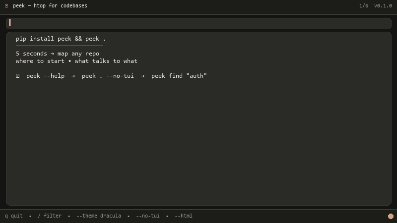

<p align="center">
  
</p>
<p align="center"><em>Demo generated by code — <code>python -m peek.tools.gen_demo</code> (Pillow, no vhs) • also <code>assets/demo.svg</code> + <code>assets/demo.html</code></em></p>

<h1 align="center">peek — htop for codebases</h1>

<p align="center"><strong>Understand any codebase in 5 seconds.</strong> <code>pip install peek && peek .</code></p>

<p align="center">
  <a href="https://pypi.org/project/peek/"></a>
  <a href="https://pypi.org/project/peek/"></a>
  <a href="https://github.com/hariomlohardev/peek/blob/main/LICENSE"></a>
  <a href="https://github.com/hariomlohardev/peek"></a>
  
</p>

<p align="center">
  <em>Beautiful, zero-config codebase cartographer — Python-native, Rich + Textual, works offline.</em><br>
  <code>peek scan</code> • <code>peek analyze</code> • <code>peek .</code> (TUI) • <code>peek --html</code> • <code>peek --pack</code> • <code>peek find</code>
</p>

---

## Install

```bash
pip install peek
# or
pipx install peek
uv tool install peek
# dev (with tests)
pip install -e ".[dev]"
```

Requires Python 3.11+.

## Usage

### 1 — Interactive TUI (viral)

```bash
peek              # TUI on current dir
peek .            # same
peek /path/to/repo
peek --no-tui     # static Rich (for screenshots / CI / pipes)
```

**TUI keys:** `q` quit • `j/k` nav • `o` open in `$EDITOR` • `/` filter • `enter` details • `esc` clear

### 2 — Static (tweet-ready)

```bash
peek --no-tui
peek . --no-tui
peek analyze .        # graph + ranking + summary
peek scan .           # file stats only
```

### 3 — P1 Features (Day 4)

```bash
# HTML export — self-contained, shareable
peek --html -o map.html
peek analyze . --html -o report.html
open map.html

# Smart LLM pack — top files within token budget
peek --pack                    # stdout (pipe to pbcopy/clip)
peek --pack --ask "auth"       # filtered
peek --pack -o pack.txt        # to file
peek --pack --ask "token" | wc -c

# Find — keyword over filenames + content, ranked
peek find "auth" .
peek find "token validation" . --limit 10 --json
peek --find "auth" .           # alias

# LLM summary (optional, needs API key)
export OPENAI_API_KEY=sk-...
peek --llm
peek analyze . --llm
```

## What it does

| Feature | `scan` | `analyze` | `peek` (TUI) |
|---|---|---|---|
| Walk respecting `.gitignore` | ✅ | ✅ | ✅ |
| Languages + LOC + by-lang bar | ✅ | ✅ | ✅ |
| Tech stack (`pyproject.toml`/`package.json` deps) | ✅ | ✅ | ✅ |
| Entry points (`main.py`/`cli.py`/`pyproject.scripts`/`__main__` guard) | ✅ | ✅ | ✅ |
| Import graph (`ast` + relative + `src/` layout) | — | ✅ | ✅ |
| PageRank + in-degree + entry bonus ranking | — | ✅ | ✅ |
| Heuristic summary (FastAPI/Django/Typer/etc.) | — | ✅ | ✅ |
| Static Rich panels | ✅ | ✅ | ✅* |
| Textual TUI (nav, filter, open) | — | — | ✅ |
| `--html` | ✅ | ✅ | ✅ |
| `--pack` / `--ask` | — | — | ✅ |
| `find` | — | — | ✅ |
| `--llm` | — | ✅ | ✅ |

`*` static via `peek --no-tui`

## Examples

### On this repo (`peek`)

```bash
peek --no-tui
# 8 files • 1445 LOC • 4 modules • 4 edges
# Summary: Typer/Click CLI tool (Rich, Textual, Typer) — 4 modules, 1445 LOC. Entry: peek/cli.py
# Start Here: 1 peek/cli.py (entry, main guard) 7.8 • 2 peek/scanner.py (hub, central) 7.6
```

### On `requests` (2 sec)

```bash
git clone https://github.com/psf/requests && peek /tmp/requests --no-tui
# See ranked Start Here, import graph, tech stack
```

### On `fastapi`

```bash
git clone https://github.com/tiangolo/fastapi && peek /tmp/fastapi --no-tui
# FastAPI + SQLAlchemy detection, entry: app/main.py
```

## Why peek?

| Tool | What it lacks that `peek` has |
|---|---|
| `gitingest` / `repomix` | No ranking, no graph, no TUI — just concatenation |
| `pydeps` / `import-linter` | No summary, no entry detection, no TUI |
| `tree` / `tokei` / `onefetch` | No import graph, no ranking |
| `code2prompt` | No local analysis, needs API |

**Peek's moat:** Every output is a screenshot. Every repo is a new demo. `pip install peek` is zero friction.

## Performance

- `< 0.2s` for peek itself (8 files)
- `< 1s` for 500-file repos (cap at 2000 files for MVP, shows truncated)
- Never crashes: handles binary, huge >1MB, `SyntaxError`, permission errors, empty repos, symlinks

## Development

```bash
git clone https://github.com/hariomlohardev/peek && cd peek
pip install -e ".[dev]"
pytest -q          # 74 passed (scanner + analyzer + renderer + themes + demo)
peek --no-tui     # static
peek              # TUI
peek find "scan" .
peek --pack --ask "analyzer" | wc -c
peek --html -o /tmp/peek.html && open /tmp/peek.html
# regenerate demo (code, no vhs)
python -m peek.tools.gen_demo   # → assets/demo.gif + assets/demo.svg
peek --html -o assets/demo.html
```

## Contributing

See [CONTRIBUTING.md](CONTRIBUTING.md). PRs welcome — add tests for new features.

## Launch

This is `v0.1.0` — built in 5 days (scanner → analyzer → TUI → P1 → polish). See [`08_launch_playbook.md`](https://github.com/hariomlohardev/peek/blob/main/docs/research/08_launch_playbook.md) for HN/Twitter/Reddit/Product Hunt checklist. Launch window: **Tue–Thu 08:00 UTC**.

## Author

Built by [Hariom Lohar](https://hariomlohardev.github.io/) — hariomlohar.new@gmail.com

## License

MIT — see [LICENSE](LICENSE)
